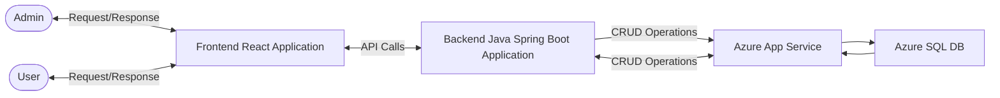

## Overview
#### This repository contains the backend implementation of the CRUD application. It is developed using Spring Boot and follows the Backend-for-Frontend (BFF) architecture pattern. The backend provides RESTful APIs to support CRUD operations on items and integrates seamlessly with an Azure SQL database.

## Architecture



## Features
- CRUD Operations: Create, Read, Update, and Delete functionality for items.
- Database Integration: Utilizes Azure SQL Database for persistent storage.
- Scalability: Built to support scalable deployments using Azure App Service.
- Seamless Integration: Designed to interact with frontend applications.

## Endpoints
| Method   | Endpoint           | Description               |
|----------|--------------------|---------------------------|
| `GET`    | `/api/items`       | Retrieve all items        |
| `GET`    | `/api/items/{id}`  | Retrieve item by ID       |
| `POST`   | `/api/items`       | Create a new item         |
| `PUT`    | `/api/items/{id}`  | Update an existing item   |
| `DELETE` | `/api/items/{id}`  | Delete an item by ID      |


## Deployment
#### The backend is deployed on Azure App Service with automated CI/CD pipelines connected to the GitHub repository. Any changes pushed to the repository trigger an automatic build and deployment.

## Technologies Used
- Spring Boot
- Java 17
- Azure SQL Database
- Azure App Service
- GitHub Actions (for CI/CD)

## Setup
1. Clone the repository:

    ```bash
    git clone https://github.com/Vasista-28/crud-application.git
    ```

2. Navigate to the project directory:

    ```bash
    cd rud-application
    ```

3. Run the application:

    ```bash
    ./mvnw spring-boot:run
    ```

#### Frontend Rpositories: 
#### [USER]: https://github.com/Vasista-28/crud-user
#### [ADMIN]: https://github.com/Vasista-28/crud-frontend-admin
